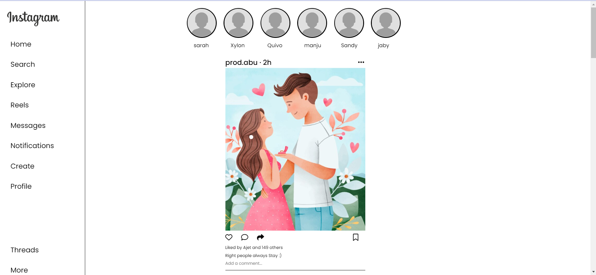
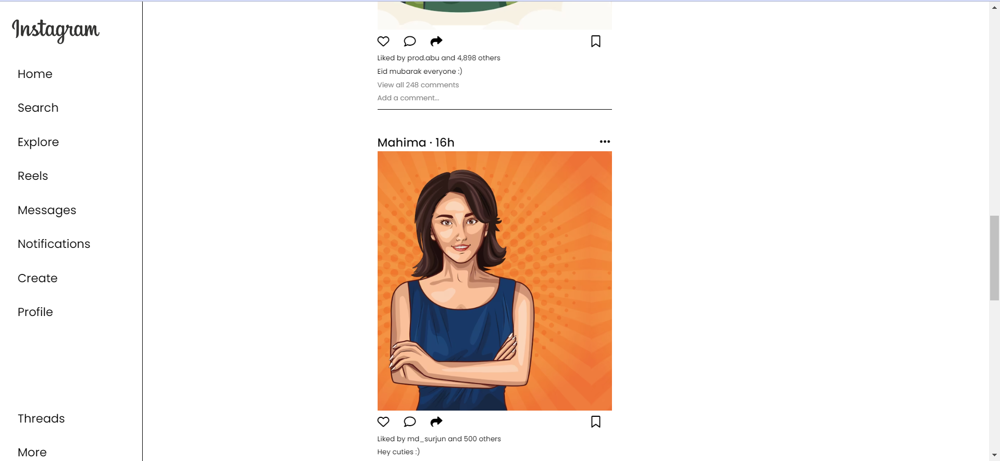
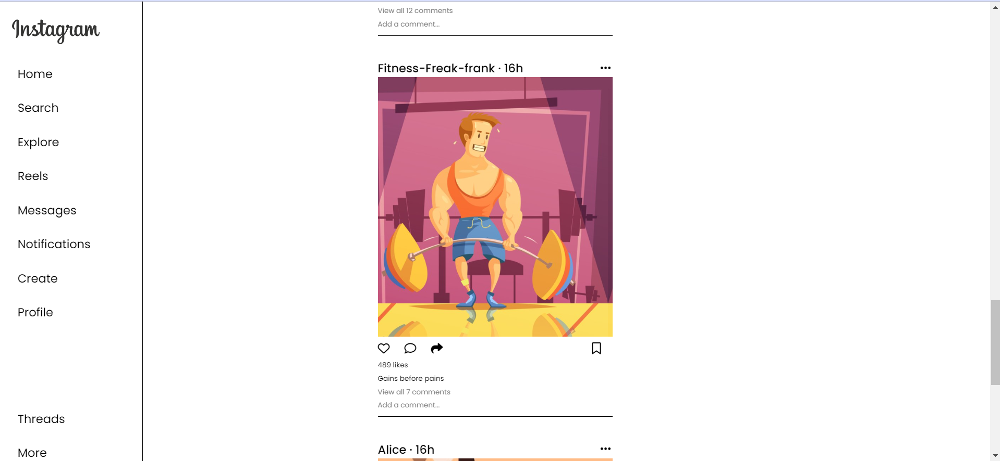

# Instagram clone using HTML and CSS:
Hey everyone i've made this simple clone of instagram using html and css. As iam a beginner i did'nt know how to add certaion things and i hope on learning it soon!

# Result : 




# Code :
## HTML: 
```
<!DOCTYPE html>
<html lang="en">
<head>
    <meta charset="UTF-8">
    <meta name="viewport" content="width=device-width, initial-scale=1.0">
    <title>Instagram</title>
    <link rel="stylesheet" href="styles.css">
    <link rel="preconnect" href="https://fonts.googleapis.com">
    <link rel="preconnect" href="https://fonts.gstatic.com" crossorigin>
    <link rel="stylesheet" href="https://cdnjs.cloudflare.com/ajax/libs/font-awesome/6.5.1/css/all.min.css" integrity="sha512-DTOQO9RWCH3ppGqcWaEA1BIZOC6xxalwEsw9c2QQeAIftl+Vegovlnee1c9QX4TctnWMn13TZye+giMm8e2LwA==" crossorigin="anonymous" referrerpolicy="no-referrer" />
    <link href="https://fonts.googleapis.com/css2?family=Bebas+Neue&family=Montserrat:ital,wght@0,100;0,200;0,300;0,400;0,500;0,600;0,700;0,800;1,100;1,200&family=Open+Sans:ital,wght@0,400;0,700;0,800;1,500&family=Poppins:ital,wght@0,100;0,200;0,300;0,400;0,500;0,600;0,700;0,800;0,900;1,100;1,200;1,300;1,400;1,500;1,600;1,700;1,800;1,900&family=Press+Start+2P&family=Quicksand:wght@300;400;500;600;700&family=Roboto:ital,wght@0,100;0,400;0,500;0,700;0,900;1,400;1,500;1,700&display=swap" rel="stylesheet">
</head>
<body>
    <div class="sidebar">
        <div class="logo">
            
        </div>

        <div class="icons">
            <p>Home</p>
            <p>Search</p>
            <p>Explore</p>
            <p>Reels</p>
            <p>Messages</p>
            <p>Notifications</p>
            <p>Create</p>
            <p>Profile</p>
        </div>
        <div class="more">
            <p>Threads</p>
            <p>More</p>
        </div>
    </div>

    <div class="story">
        <div class="circles_1">
            
            <p>sarah</p>
        </div>
        <div class="circles_2">
            
            <p>Xylon</p>
        </div>
        <div class="circles_3">
            
            <p>Quivo</p>
        </div>
        <div class="circles_4">
            
            <p>manju</p>
        </div>
        <div class="circles_5">
            
            <p>Sandy</p>
        </div>
        <div class="circles_6">
            
            <p>jaby</p>
        </div>

    </div>

    <div class="box">
        <div class="heading">
            <p class="username">prod.abu &centerdot; 2h</p>
            <i class="fa-solid fa-ellipsis"></i>
        </div>
        <div class="image_1"></div>
        <div class="fav">
            <div class="ivon">
                <i class="fa-regular fa-heart"></i>
                <i class="fa-regular fa-comment"></i>
                <i class="fa-solid fa-share"></i>
            </div>
            <i class="fa-regular fa-bookmark"></i>
        </div>
        <p class="description">Liked by Ajet and 149 others</p>
        <p class="description">Right people always Stay :)</p>
        <p class="comments">Add a comment...</p>
     
    </div>
    <br>
    <div class="box">
        <div class="heading">
            <p class="username">Only_Cats &centerdot; 8h</p>
            <i class="fa-solid fa-ellipsis"></i>
        </div>
        <div class="image_2"></div>
        <div class="fav">
            <div class="ivon">
                <i class="fa-regular fa-heart"></i>
                <i class="fa-regular fa-comment"></i>
                <i class="fa-solid fa-share"></i>
            </div>
            <i class="fa-regular fa-bookmark"></i>
        </div>
        <p class="description">11,598 likes</p>
        <p class="description">Meow :></p>
        <p class="comments">View all 120 comments</p>
        <p class="comments">Add a comment...</p>
    </div>
    <br>
    <div class="box">
        <div class="heading">
            <p class="username">Fearless_fathima_786 &centerdot; 14h</p>
            <i class="fa-solid fa-ellipsis"></i>
        </div>
        <div class="image_3"></div>
        <div class="fav">
            <div class="ivon">
                <i class="fa-regular fa-heart"></i>
                <i class="fa-regular fa-comment"></i>
                <i class="fa-solid fa-share"></i>
            </div>
            <i class="fa-regular fa-bookmark"></i>
        </div>
        <p class="description">Liked by prod.abu and 4,898 others</p>
        <p class="description">Eid mubarak everyone :)</p>
        <p class="comments">View all 248 comments</p>
        <p class="comments">Add a comment...</p>
    </div>
    <br>
    <div class="box">
        <div class="heading">
            <p class="username">Mahima &centerdot; 16h</p>
            <i class="fa-solid fa-ellipsis"></i>
        </div>
        <div class="image_4"></div>
        <div class="fav">
            <div class="ivon">
                <i class="fa-regular fa-heart"></i>
                <i class="fa-regular fa-comment"></i>
                <i class="fa-solid fa-share"></i>
            </div>
            <i class="fa-regular fa-bookmark"></i>
        </div>
        <p class="description">Liked by md_surjun and 500 others</p>
        <p class="description">Hey cuties :)</p>
        <p class="comments">View all 12 comments</p>
        <p class="comments">Add a comment...</p>
    </div>
    <br>
    <div class="box">
        <div class="heading">
            <p class="username">Fitness-Freak-frank &centerdot; 16h</p>
            <i class="fa-solid fa-ellipsis"></i>
        </div>
        <div class="image_5"></div>
        <div class="fav">
            <div class="ivon">
                <i class="fa-regular fa-heart"></i>
                <i class="fa-regular fa-comment"></i>
                <i class="fa-solid fa-share"></i>
            </div>
            <i class="fa-regular fa-bookmark"></i>
        </div>
        <p class="description">489 likes</p>
        <p class="description">Gains before pains</p>
        <p class="comments">View all 7 comments</p>
        <p class="comments">Add a comment...</p>
    </div>
    <br>
    <div class="box">
        <div class="heading">
            <p class="username">Alice &centerdot; 16h</p>
            <i class="fa-solid fa-ellipsis"></i>
        </div>
        <div class="image_6"></div>
        <div class="fav">
            <div class="ivon">
                <i class="fa-regular fa-heart"></i>
                <i class="fa-regular fa-comment"></i>
                <i class="fa-solid fa-share"></i>
            </div>
            <i class="fa-regular fa-bookmark"></i>
        </div>
        <p class="description">1001 likes</p>
        <p class="description">I've got a date</p>
        <p class="comments">View all 50 comments</p>
        <p class="comments">Add a comment...</p>
    </div>
    <br>


</body>
</html>

```
## CSS :
```
*{
    margin: 0;
    padding: 0;
    font-size: 20px;
    font-family: 'poppins';
}

.sidebar{
    height: 100vh;
    width: 12%;
    display: flex;
    flex-direction: column;
    justify-content: space-between;
    position: fixed;
    border-right: solid 1px black;
    padding: 0px 20px;
    background-color: white;

}
.logo{
    margin-top: 20px;
    margin-left: 10px;
    font-weight: bold;
}
.logo:hover{
    color: red;
}
.icons{
    display: flex;
    flex-direction: column;
    justify-content: space-between;
    position: absolute;
    margin-top: 80px;
    margin-left: 10px;

}
.instagram{
    width: 150px;
    margin-left: -10px;
    margin-top: 10px;
}
.icons p{
    margin-top: 28px;
}
.more{
    display: flex;
    flex-direction: column;
    justify-content: space-evenly;

}
.more p{
    margin-top: 28px;
    margin-left: 10px;
}
.box{
    height: 600px;
    width: 400px;
    border: 1px solid;
    margin-left: auto;
    margin-right: auto;
    display: flex;
    flex-direction: column;
    justify-content: space-between;
    padding: 10px 0px; 
    border-left: none;
    border-right: none;
    border-top: none;
}
.heading{
    display: flex;
    justify-content: space-between;
}
.heading i{
    margin-top: 5px;
    margin-right: 3px;
}
.image_1{
    height: 700px;
    width: 400px;
    border: none;
    background-image: url(images/posts/post_1.png);
    background-size: cover;
    background-position: -60px;
}
.image_2{
    height: 700px;
    width: 400px;
    border: none;
    background-image: url(images/posts/post_2.png);
    background-size: cover;
    background-position: -80px;
}
.image_3{
    height: 700px;
    width: 400px;
    border: none;
    background-image: url(images/posts/post_3.png);
    background-size: cover;
    background-position: -80px;
}
.image_4{
    height: 700px;
    width: 400px;
    border: none;
    background-image: url(images/posts/post_4.png);
    background-size: cover;
    background-position: -80px;
}
.image_5{
    height: 700px;
    width: 400px;
    border: none;
    background-image: url(images/posts/post_5.png);
    background-size: cover;
    background-position: -50px;
}
.image_6{
    height: 700px;
    width: 400px;
    border: none;
    background-image: url(images/posts/post_6.png);
    background-size: cover;
    background-position: 0px;

}
.username{
    font-weight: 500;

}
.description{
    
    font-size: 12px;
    margin-top: 5px;
}
.comments{
    color: grey;
    font-size: 12px;
    margin-top: 5px;
}
.fav{
    display: flex;
    flex-direction: row;
    justify-content: space-between;
    
}
.fav i{
    margin-top: 10px;
    margin-right: 20px;
}

.story{
    height: 101px;
    width: 620px;
    margin-left: auto;
    margin-right:auto ;
    border: none;
    margin-bottom: 10px;
    padding: 20px;
    display: flex;

}
.story p{
    font-size: 15px;
    margin-left: 17px;
}

.circles_1{
    height: 80px;
    width: 80px;
    border: solid 3px black;
    border-radius: 50px;
    margin-right: 20Px;
    
}
.circles_1 img{
    width: 98px;
    margin-left: -11px;
    margin-top: -5px;
}
.circles_2{
    height: 80px;
    width: 80px;
    border: solid 3px black;
    border-radius: 50px;
    margin-right: 20Px;
    
}
.circles_2 img{
    width: 98px;
    margin-left: -11px;
    margin-top: -5px;
}
.circles_3{
    height: 80px;
    width: 80px;
    border: solid 3px black;
    border-radius: 50px;
    margin-right: 20Px;
    
}
.circles_3 img{
    width: 98px;
    margin-left: -11px;
    margin-top: -5px;
}
.circles_4{
    height: 80px;
    width: 80px;
    border: solid 3px black;
    border-radius: 50px;
    margin-right: 20Px;
    
}
.circles_4 img{
    width: 98px;
    margin-left: -11px;
    margin-top: -5px;
}
.circles_5{
    height: 80px;
    width: 80px;
    border: solid 3px black;
    border-radius: 50px;
    margin-right: 20Px;
    
}
.circles_5 img{
    width: 98px;
    margin-left: -11px;
    margin-top: -5px;
}
.circles_6{
    height: 80px;
    width: 80px;
    border: solid 3px black;
    border-radius: 50px;
    margin-right: 20Px;
    
}
.circles_6 img{
    width: 98px;
    margin-left: -11px;
    margin-top: -5px;
}

```
# Image credits :
https://www.freepik.com/